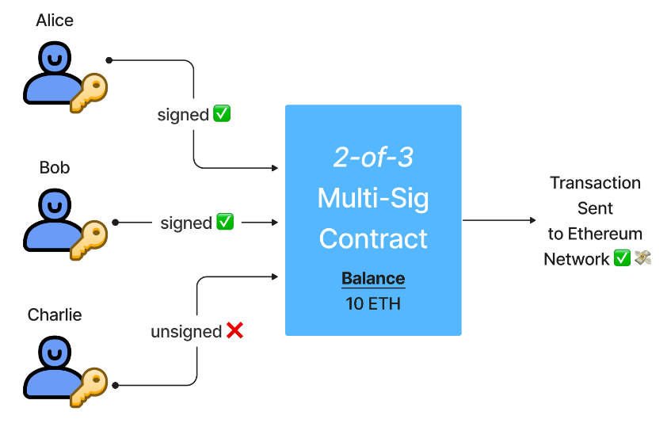

# multi-sig_smart_contract

A multi-signature contract is a smart contract designed so that multiple signatures from different addresses are needed for a transaction to be executed. This project is a part of Alchemy University's Ethereum developer bootcamp curriculum.

## Implementation Overview

In the above case, the smart contract requires 2-of-3 keys signatures in order to approve and send a transaction to the Ethereum network.

With this setup, it doesn’t matter whether one individual loses their key, as there will be other individuals that can approve transactions, kick out the compromised key and re-add the compromised user under a new address.

Splitting responsibility of ownership of an address and its funds between multiple people means the multi-sig wallet is secure against a single key being the single point of failure. Even if there is a malicious party in the multi-sig contract, they would need to corrupt a majority of the holders to compromise the wallet entirely.

The transaction IDs are zero-based. In the first `addTransaction`, the transaction with Id 0 is added and the `transactionCount` becomes 1.
In the next `addTransaction`, the transaction with Id 1 is added and the `transactionCount` becomes 2 and so on.

## Use cases

A multi-signature contract acts as a "wallet" as it can hold and transfer funds. It is called "multi-sig" because it typically needs greater than one signatures to approve any wallet activity such as transferring funds out. Since multi-sigs are powered by multiple keys, they avoid a single point of failure, which makes it significantly harder for funds to be compromised. This design provides a higher degree of security against lost or compromised keys.

Here are a few use cases that can be powered by a multi-signature smart contract wallet:

- Families: Inheritance, Wills, Approved Expenditure of House Expenses
- Businesses/Startups: Business Expenses, Treasury Management, Embezzlement Protection
- Teams/Organizations: Team Jerseys, Travel Expenses
